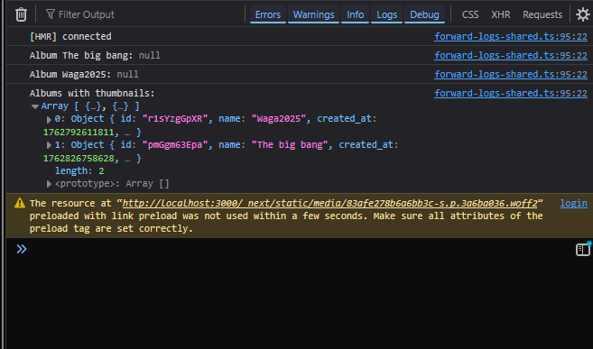

# User Profile Feature

## Overview
Users can now view public profiles by clicking on comment author names. Profiles display:
- Display name / username
- Avatar
- Member since date
- Social media links (Instagram, Twitter)

## Implementation

### Database Changes
Added `user_id` column to the `comments` table to link comments to user profiles:
- Authenticated users: `user_id` is populated automatically
- Anonymous users: `user_id` remains NULL

**Migration Required:**
Run the SQL migration in `migrations/add_user_id_to_comments.sql` in your Supabase SQL Editor.

### Routes
- **`/user/[username]`** - Public profile page for any user

### API Changes
- Comments API now stores `user_id` for authenticated commenters
- GET endpoint enriches comments with `username` for profile linking

### UI Changes
- Comment author names are now clickable links (when user_id exists)
- Clicking opens the user's public profile page
- Anonymous comments remain non-clickable

### Security
- Only public profile information is displayed (no email addresses)
- Profile pages are accessible to anyone with the username
- Social links are optional and only shown if provided by the user

## Usage

1. **As a commenter:** When you're signed in and comment on a photo, your comment will automatically link to your profile
2. **As a viewer:** Click any author name in comments to view their public profile
3. **Anonymous comments:** Comments from non-authenticated users don't have profile links

## Future Enhancements
- Activity feed showing user's recent comments
- Albums created by user
- Photo upload count
- Reputation/badges system
